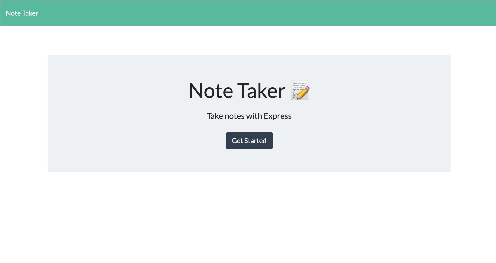
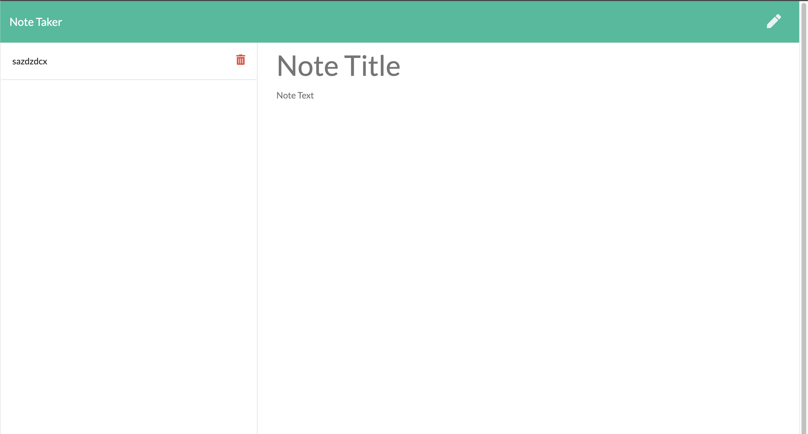

# Note Taker
  


## Table of Contents
  - [Description](#description)
  - [Installation](#installation)
  - [Usage](#usage)
  - [Contribution](#contribution)
  - [Test-Instructions](#test-instructions)
  - [License](#license)
  - [Repository](#repository)
  - [Link](#link)
  - [Questions](#questions)

## Description
Application that can be used to write, save, and delete notes. Uses an Express backend to save and retrieve note data from JSON. 

Made for users that need to keep track of a lot of information, allowing the user to have written information available when needed.


## Installation
To use this application, please follow these steps: 

```md 
Run npm i

```

## Usage
Use heroku link or:

```
Run node server.js

Use the port provided in terminal

```

## Contribution

If you would like to contribute to this project reach out to me. Contact Information can be found below.

## Test-Instructions
run: `npm run test`

## License
This application is licensed under the MIT license.

[MIT License](https://opensource.org/licenses/BSD-3-Clause)

## Repository
[Github Repo](https://github.com/NadineMohsen/Note-Taker)

## Link 
There's no deployed link for this project.

## Questions
For any questions you can reach me on github or by email
- Github [My Profile on Github](https://github.com/NadineMohsen)
- Email nadine.mohsen@hotmail.com

## Demo



## Links to Demo

[HEROKU APPLICATION](https://arcane-mountain-03711.herokuapp.com/)

